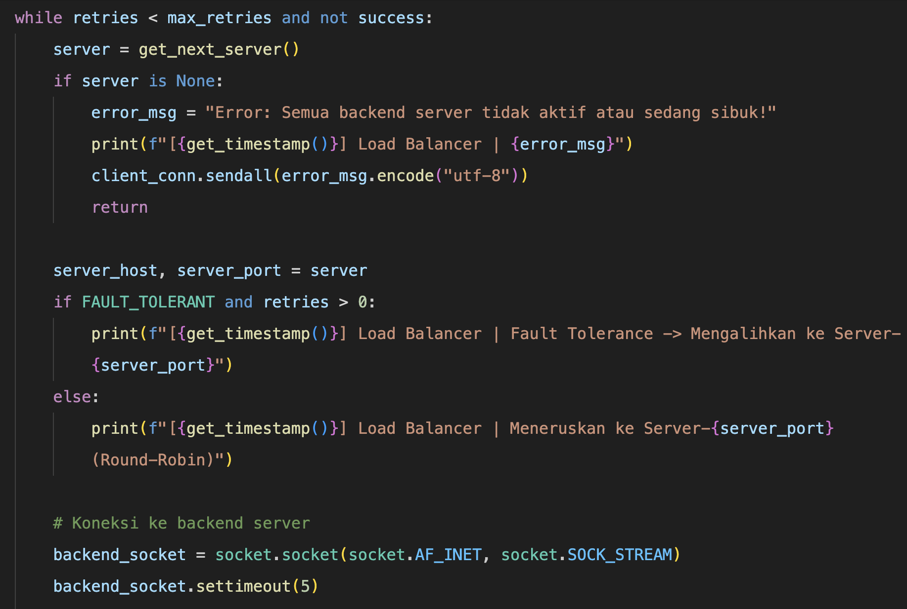
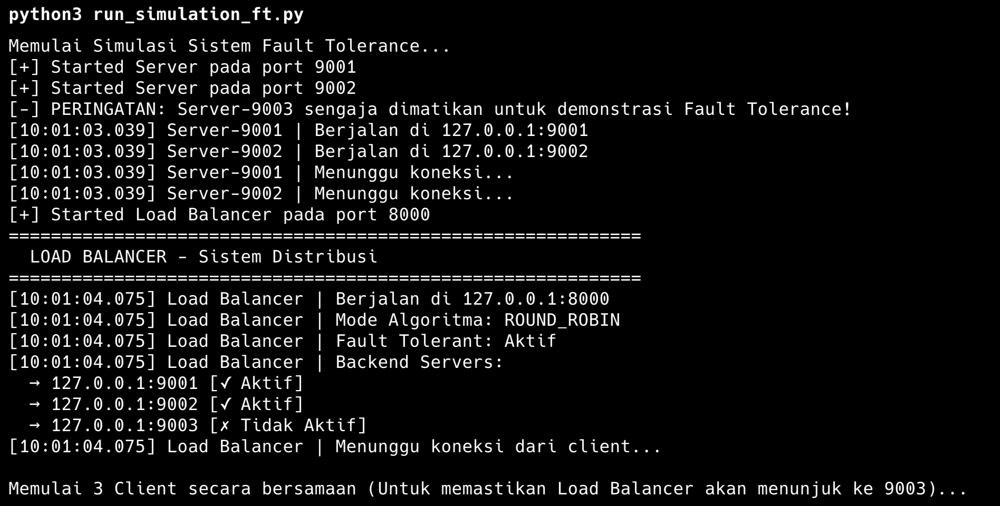

# Nama: M. Hamdani Ilham Latjoro
# NIM: D082252019
# Sistem Distribusi dengan Fault Tolerance

## 1. Konsep Dasar Fault Tolerance pada Sistem Terdistribusi

Dalam ilmu Sistem Terdistribusi, **Fault Tolerance** (Toleransi Kesalahan) adalah sifat yang memungkinkan sebuah sistem untuk terus beroperasi dengan baik meskipun satu atau beberapa komponennya (seperti _node_ server, jaringan, atau basis data) mengalami kegagalan (putus, _crash_, atau _timeout_).

Tujuan utama dari mekanisme ini adalah menciptakan tingkat ketersediaan tinggi (*High Availability*) dan menyembunyikan kegagalan dari kacamata pengguna akhir/Client (*Failure Transparency*). 

Dalam arsitektur sistem yang dibangun ini:
*   Beban kerja (request) didistribusikan oleh **Load Balancer**.
*   Namun *hardware/services* pada server tujuan (misal: Server-9002) bisa saja tiba-tiba mati atau bermasalah saat sedang diakses oleh client di jaringan lain.
*   Peran _Fault Tolerance_ yaitu memastikan jika *server down*, permintaan Client tidak memunculkan halaman *Error yang fatal*, melainkan diam-diam dialihkan secara otomatis ke peladen/server pengganti yang masih hidup di dalam cluster (_Failover_).

---

## 2. Implementasi Fault Tolerance di Load Balancer (`load_balancer.py`)

Pada simulasi ini, mekanisme Fault Tolerance dibangun di dalam fungsi skrip jaringan `forward_request()` yaitu merombak skenario algoritma penyebaran **Round-Robin**.

### A. Pengaktifan Fitur
Fitur *Fault Tolerance* dikontrol menggunakan variabel global `FAULT_TOLERANT = True`.

### B. Mekanisme Kerja Internal
Jika mode ini aktif, program akan melakukan prosedur berikut saat klien mengirim permintaan (_Task Mission_):
1.  **Iterasi (Retry Loop)**: Load balancer menginisialisasi perulangan (_while loop_) dengan batas maksimum percobaan _max_retries_ (setara dengan total keseluruhan server jaringan yang terdaftar, yaitu maksimal tiga kali percobaan failover).
2.  **Pemilihan & Pengiriman Beban**: Load balancer memilih satu server rute awal (via `get_next_server()`) lalu mencoba membangun sesi soket (`socket.connect()`).
3.  **Tangkapan Eksepsi (Exception Catching)**: Apabila saat *connect* atau saat menantikan respon *(recv)* server mengalami _Connection Refused_ atau _Timeout_ secara parsial saat simulasi berjalan lama:
    *   Sistem biasa akan langsung menghasilkan *Crash program* atau memberitahu Klien terjadi _Error_.
    *   Sistem *Fault Tolerant* akan secara *silent* menangkap pegecualian kode eror jaringan tersebut melalui parameter blok `except`.
4.  **Graceful Degration (Peralihan Beban Aman)**: 
    *   Load Balancer mencetak informasi ke dalam *log terminal* internalnya dengan notifikasi peringatan: `[FAULT TOLERANCE] Mencoba server lain...`
    *   Sesi soket lama server yang *drop* atau rusak tersebut dipaksakan tertutup (`backend_socket.close()`).
    *   Hak perizinan *limit connection* / *semaphore* di-*release* agar tidak memicu insiden *memory leak* di server yang mati.
    *   *Loop* akan mengulang lagi lompatan pada langkah ke-2, kali ini memutar kunci arah mencoba mendaftarkan node server berikutnya hingga ia berhasil menangkap respon kemuliaan tugas (`success = True`).

---

## 3. Cara Menjalankan Simulasi Fault Tolerance

Mekanisme replikasi dan load balancing reguler sangat ramah, tetapi pada uji ini, kita harus bermain dengan _Sabotase Node Server_ agar efek *Fault-Tolerance* terlihat kasat mata (simulasi mematikan sebuah server di tengah permainan).

**Langkah Eksekusi Eksperimen:**
1. Siapkan aplikasi multi-Terminal (membuka beberapa buah _tab/window command-line_).
2. Jalankan sistem pondasi satu per satu:
    * `python load_balancer.py` (Pada Terminal 1)
    * `python server.py 9001` (Pada Terminal 2)
    * Abaikan dan **Jangan nyalakan port 9002 maupun port 9003**. Kondisikan simulasi di mana dua server mati akibat listrik padam dll.
3. Jalankan lalu lalang dari _Client_ secara manual: `python client.py 1` (Pada Terminal Terakhir)

Mekanisme kerjanya akan beroperasi. Load Balancer secara utuh mengkalkulasikan pergerakan *Round-Robin* dan akan menunjuk panah ke urutan Server **9002** & Server **9003** (yang di mana dua server tersebut sama-sama rusak/mati/belum dinyalakan). Melalui kepekaannya, program kemudian melakukan *Failover* di balik layar dan secara cerdas melemparkan ulang kelemahan transfer tersebut ke pangkuan Server **9001** yang senantiasa masih prima.

---

## 4. Analisis Log Hasil Eksekusi Fault Tolerance

Dalam hal kegagalan komunikasi jaringan, berikut jejak detil dari rekam catatan:

### Terminal Output Load Balancer (Saat Menghadapi Server Mati)
```
[10:30:15.101] Load Balancer | Request diterima dari ('127.0.0.1', 89004)
[10:30:15.101] Load Balancer | Data: "{"client_id": "1", ...}"
[10:30:15.101] Load Balancer | Meneruskan ke Server-9002 (Round-Robin)
[10:30:15.103] Load Balancer | Error: Gagal terhubung ke Server-9002: [Errno 61] Connection refused
[10:30:15.103] Load Balancer | [FAULT TOLERANCE] Mencoba server lain...
[10:30:15.103] Load Balancer | Fault Tolerance -> Mengalihkan ke Server-9003
[10:30:15.103] Load Balancer | Error: Gagal terhubung ke Server-9003: [Errno 61] Connection refused
[10:30:15.103] Load Balancer | [FAULT TOLERANCE] Mencoba server lain...
[10:30:15.104] Load Balancer | Fault Tolerance -> Mengalihkan ke Server-9001
[10:30:15.607] Load Balancer | Response dari Server-9001 diteruskan ke client
```

### Penjelasan Log
Rentetan log terminal yang sangat berharga tersebut memecahkan arti berikut:
1. Ketika bertransmisi normal menabrak `Server-9002` & `Server-9003` yang mogok, mekanisme mendeteksi pelepasan *Error Event* (`Connection refused`).
2. Proses otomatis _Failover_ aktif yang bertanda `[FAULT TOLERANCE] Mencoba server lain...` tanpa jeda lalu menerbangkan paket datanya dan **Mengalihkan ke Server-9001**.
3. Di sisi layar *Client*, pada detik ke `[10:30:15.607]`, ia tidak menyadari apapun terkait pertumpahan koneksi pada server-server sebelumnya. Ia sepenuhnya menerima kembalian hasil dalam kondisi `Sukses/Penuh`. Inilah yang dinamakan keistimewaan _Failure Transparency_ dalam ilmu Sistem Distribusi. Sistem ini membuktikan dirinya sebagai instrumen dengan derajat kehandalan murni (**Robust / Reliable**).

## Lampiran: Screenshot

### Kode Program Fault Tolerance


### Log Output Fault Tolerance

