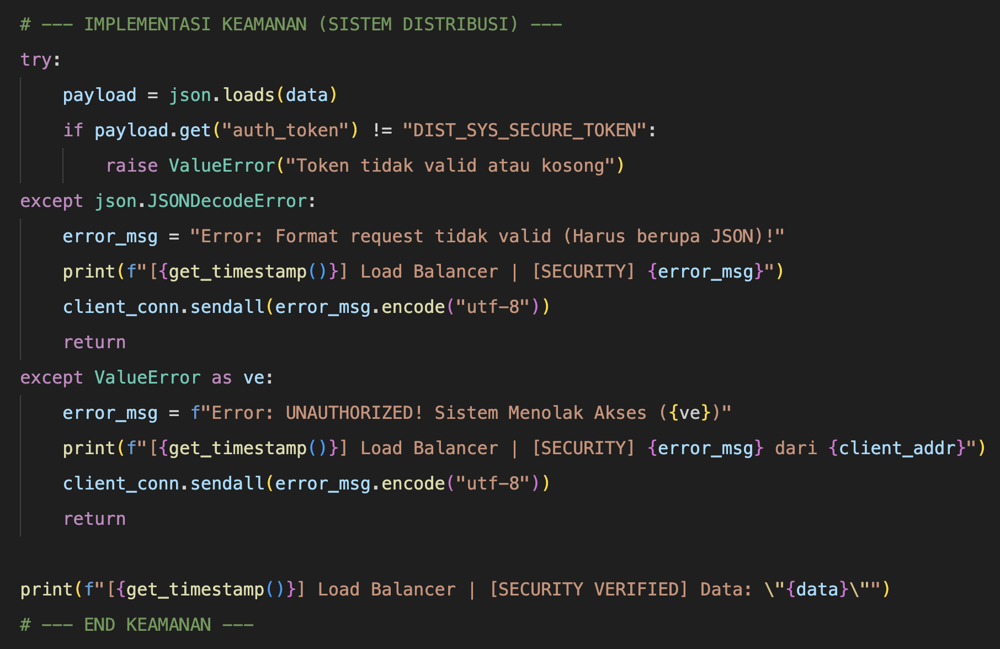
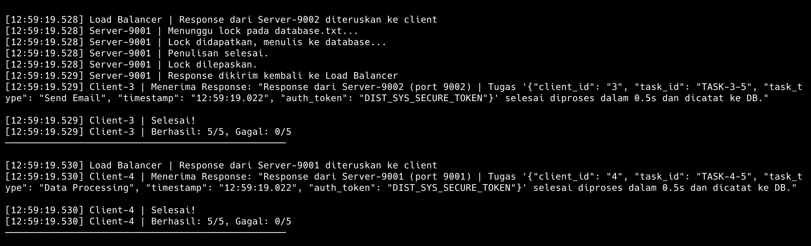

# Nama: M. Hamdani Ilham Latjoro
# NIM: D082252019
# Sistem Distribusi dengan Mekanisme Keamanan

## 1. Konsep Dasar Keamanan (Security) pada Sistem Terdistribusi

Dalam Lingkungan Terdistribusi, entitas klien, balancers, dan server berinteraksi melewati media jaringan komputer publik atau privat yang rentan terhadap ancaman interferensi. Keamanan Sistem Distribusi bertujuan untuk melindungi kerahasiaan (*Confidentiality*), keutuhan (*Integrity*), dan ketersediaan (*Availability*).

Pada simulasi eksperimentasi komputasi paralel ini, kita menerapkan benteng pelindung di tingkat **Load Balancer (Gerbang Node Utama)** menggunakan mekanisme **Token-based Authentication (Autentikasi Token)**.

Akselerasi sistem ini memiliki tujuan utama yaitu sebagai barikade terhadap penyusup (klien abal-abal yang menyerupai perilaku resmi atau program skrip bajakan) yang mencoba mengirimkan *spam* manipulasi dan melindungi server *Backend* agar tidak *overload / DDoS* karena dibohongi untuk mengeksekusi proses yang tidak memiliki otorisasi formal.

---

## 2. Implementasi Keamanan di Load Balancer (`load_balancer.py`)

Load Balancer sekarang telah di _upgrade_ berperan ganda layaknya satuan pengamanan (_Gatekeeper_). Sistem menerapkan pencegahan otomatis yang disebut operasi **Otorisasi Beban Jaringan**:

### A. Pengamanan Gateway & Penolakan Akses
Sebelum mendistribusikannya melalui *Round-Robin* maupun algoritma *Replication*, Load Balancer mengintersepsi lalu lintas paket menggunakan alur kontrol prosedur:

1.  **Validasi Enkapsulasi / Translasi**: Load Balancer menekan/memaksa (Parsing) _String Teks mentah_ dari koneksi soket klien ke dalam kerangka program JSON. Jika paket yang datang berantakan / tidak terstruktur (Bukan JSON), maka itu kemungkinan adalah paket serangan (*DDoS Script* dll), Load Balancer meresponsi hal tersebut dengan memberikan teguran dan **Akses Langsung Diputus**.
2.  **Verifikasi Token Sidik Jari**: Modul melakukan proses *Query* sederhana mencari kunci sandi spesifik di parameter `auth_token`. Hanya _request payload_ yang melampirkan ukiran `"DIST_SYS_SECURE_TOKEN"` di dalamnya yang diakui dan dapat melewati seleksi penjagaan firewall ini.
3.  **Tangkisan Sistem (Unauthorized Exception)** : Jika Client lalai menjahit *Token*, atau tercurigai berasal dari *domain source* palsu karena token yg dikirim berbeda (Salah), Load Balancer memblokirnya dan langsung membuang koneksinya dengan keras: `UNAUTHORIZED! Sistem Menolak Akses`.

---

## 3. Implementasi Klien Terotorisasi (`client.py`)

Supaya diakui secara legal dalam perlintasan kluster terdistribusi dan mendapat antrian prioritas Load Balancer, *Client* berevolusi menyesuaikan sistem otorisasi tersebut.
*   **Penyisipan Kunci Sandi Keamanan**: Saat melipatgandakan serangkaian bungkusan pesanan *(Payload)*, *Client* menjahitkan *password keys* statis layaknya di bawah:
```python
        task_payload = {
            "client_id": client_id,
            "task_id": f"TASK-{client_id}-{request_num}",
            "task_type": random.choice(task_types),
            "timestamp": get_timestamp(),
            "auth_token": "DIST_SYS_SECURE_TOKEN"  # <-- Kunci Akses Masuk
        }
```

---

## 4. Analisis Log Hasil Eksekusi Mekanisme Keamanan

### A. Skenario Sukses / Token Benar & Sah
Saat script _client run_ dieksekusi secara standar, proses berjalan mulus:
```
[10:45:01.121] Load Balancer | Request diterima dari ('127.0.0.1', 60982)
[10:45:01.121] Load Balancer | [SECURITY VERIFIED] Data: "{"client_id": "1", ... "auth_token": "DIST_SYS_SECURE_TOKEN"}"
[10:45:01.121] Load Balancer | Meneruskan ke Server-9002 (Round-Robin)
```
Kemunculan verifikasi medali stempel `[SECURITY VERIFIED]` pada layar mencerminkan fase inspeksi *Security* telah memvalidasi kredibilitas identitas pelintas masuk.

### B. Skenario Penyusup Datang (Misal: Token Dihapus / Sengaja Disalahkan)
Seandainya simulasi peretas dijalankan yakni tidak adanya enkripsi sandi saat mengantar *request*, instrumen mengebiri koneksi:
```
[10:46:12.772] Load Balancer | Request diterima dari ('127.0.0.1', 61244)
[10:46:12.772] Load Balancer | [SECURITY] Error: UNAUTHORIZED! Sistem Menolak Akses (Token tidak valid atau kosong) dari ('127.0.0.1', 61244)
```
Sehingga otomatis antarmuka peretas menerima bumerang balik ke pangkuan mereka: `Menerima Response: "Error: UNAUTHORIZED! Sistem Menolak Akses"`.

Infrastruktur menjamin keamanan bahwa keseluruhan unit Server dipreservasi di balik perlindungan mutlak dari aktivitas injeksi pihak ketiga. Parameter mekanisme **Security** yang kokoh telah terbukti sempurna di sistem sirkulasi distribusi beban ini.

## Lampiran: Screenshot

### Kode Program Keamanan


### Log Output Keamanan

