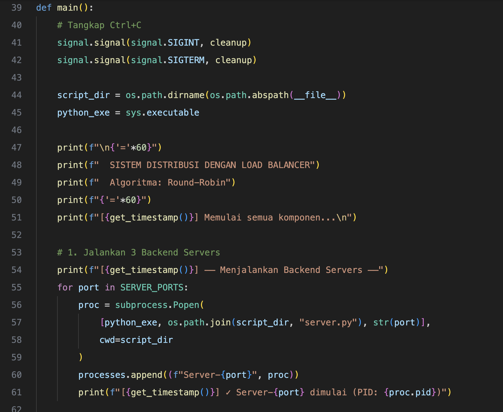
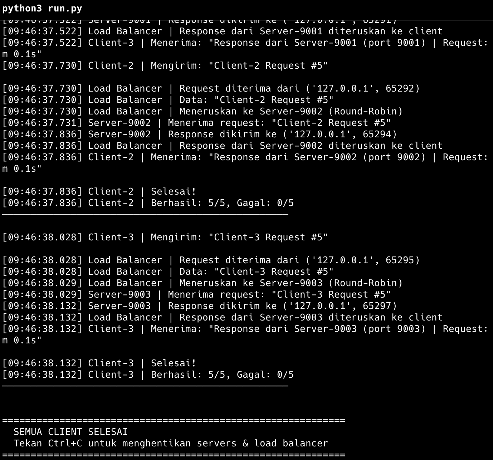

# Nama: M. Hamdani Ilham Latjoro
# NIM: D082252019
# Sistem Distribusi dengan Load Balancer

## Deskripsi

Sistem distribusi sederhana menggunakan **Python Socket Programming** yang mendemonstrasikan konsep **Load Balancing** dengan algoritma **Round-Robin**. Sistem ini terdiri dari 3 komponen utama: Backend Servers, Load Balancer, dan Clients.

---

## Arsitektur Sistem

```
                    ┌─────────────┐
 ┌───────────┐     │             │     ┌──────────────────┐
 │ Client 1  │────▶│             │────▶│ Server 1 (:9001) │
 └───────────┘     │             │     └──────────────────┘
                   │    Load     │
 ┌───────────┐     │  Balancer   │     ┌──────────────────┐
 │ Client 2  │────▶│  (:8000)   │────▶│ Server 2 (:9002) │
 └───────────┘     │             │     └──────────────────┘
                   │ Round-Robin │
 ┌───────────┐     │             │     ┌──────────────────┐
 │ Client 3  │────▶│             │────▶│ Server 3 (:9003) │
 └───────────┘     └─────────────┘     └──────────────────┘
```

### Alur Kerja

1. **Client** mengirim request ke **Load Balancer** (port 8000)
2. **Load Balancer** menerima request dan memilih **Backend Server** menggunakan algoritma **Round-Robin**
3. **Load Balancer** meneruskan (forward) request ke Backend Server yang dipilih
4. **Backend Server** memproses request dan mengirim response ke Load Balancer
5. **Load Balancer** meneruskan response kembali ke Client

---

## Komponen

### 1. Backend Server (`server.py`)

Server backend yang menerima dan memproses request dari Load Balancer.

| Fitur | Keterangan |
|---|---|
| Protocol | TCP Socket |
| Concurrency | Multi-threaded (satu thread per koneksi) |
| Host | `127.0.0.1` |
| Port | Dinamis (diatur via argumen) |

**Cara kerja:**
- Mendengarkan koneksi pada port yang ditentukan
- Setiap koneksi masuk ditangani oleh thread terpisah
- Memproses request dengan delay simulasi (0.1 detik)
- Mengirim response berisi informasi server, request, dan waktu proses

### 2. Load Balancer (`load_balancer.py`)

Komponen inti yang mendistribusikan request dari client ke backend servers.

| Fitur | Keterangan |
|---|---|
| Algoritma | Round-Robin |
| Port | `8000` |
| Backend Servers | 3 server (port 9001, 9002, 9003) |
| Health Check | Ya (skip server yang tidak aktif) |
| Statistik | Menampilkan distribusi saat dihentikan |

**Algoritma Round-Robin:**
```
Request 1  → Server 9001
Request 2  → Server 9002
Request 3  → Server 9003
Request 4  → Server 9001  (kembali ke awal)
Request 5  → Server 9002
...
```

**Health Check:**
- Sebelum meneruskan request, load balancer memeriksa apakah server tujuan aktif
- Jika server tidak aktif, request akan diteruskan ke server berikutnya yang aktif
- Jika semua server tidak aktif, client akan menerima pesan error

### 3. Client (`client.py`)

Client yang mengirim request ke Load Balancer.

| Fitur | Keterangan |
|---|---|
| Target | Load Balancer (`127.0.0.1:8000`) |
| Jumlah Request | 5 request per client |
| Delay | 0.5 detik antar request |
| Timeout | 10 detik per request |

### 4. Runner Script (`run.py`)

Script otomatis untuk menjalankan semua komponen sekaligus.

| Fitur | Keterangan |
|---|---|
| Urutan Start | Servers → Load Balancer → Clients |
| Proses | Subprocess per komponen |
| Cleanup | Ctrl+C menghentikan semua proses |

---

## Cara Menjalankan

### Metode 1: Otomatis (Semua Sekaligus)

```bash
python run.py
```

Script ini akan menjalankan semua komponen secara otomatis:
1. Menjalankan 3 backend servers (port 9001, 9002, 9003)
2. Menjalankan load balancer (port 8000)
3. Menjalankan 3 clients yang mengirim request
4. Tekan **Ctrl+C** untuk menghentikan semua proses

### Metode 2: Manual (Terminal Terpisah)

Buka **7 terminal** dan jalankan perintah berikut:

```bash
# Terminal 1: Server 1
python server.py 9001

# Terminal 2: Server 2
python server.py 9002

# Terminal 3: Server 3
python server.py 9003

# Terminal 4: Load Balancer
python load_balancer.py

# Terminal 5: Client 1
python client.py 1

# Terminal 6: Client 2
python client.py 2

# Terminal 7: Client 3
python client.py 3
```

---

## Contoh Output

### Output Load Balancer

```
============================================================
  LOAD BALANCER - Sistem Distribusi
============================================================
[09:46:00.123] Load Balancer | Berjalan di 127.0.0.1:8000
[09:46:00.123] Load Balancer | Algoritma: Round-Robin
[09:46:00.123] Load Balancer | Backend Servers:
  → 127.0.0.1:9001 [✓ Aktif]
  → 127.0.0.1:9002 [✓ Aktif]
  → 127.0.0.1:9003 [✓ Aktif]

[09:46:01.234] Load Balancer | Request diterima dari ('127.0.0.1', 65182)
[09:46:01.234] Load Balancer | Data: "Client-1 Request #1"
[09:46:01.234] Load Balancer | Meneruskan ke Server-9001 (Round-Robin)
[09:46:01.340] Load Balancer | Response dari Server-9001 diteruskan ke client
```

### Output Client

```
──────────────────────────────────────────────────
  CLIENT-1 - Sistem Distribusi
──────────────────────────────────────────────────
[09:46:01.234] Client-1 | Mengirim: "Client-1 Request #1"
[09:46:01.340] Client-1 | Menerima: "Response dari Server-9001 (port 9001) | ..."

[09:46:03.456] Client-1 | Selesai!
[09:46:03.456] Client-1 | Berhasil: 5/5, Gagal: 0/5
```

### Statistik Distribusi (saat Ctrl+C)

```
============================================================
  STATISTIK DISTRIBUSI LOAD BALANCER
============================================================
  Server-9001:   5 request ( 33.3%) ██████
  Server-9002:   5 request ( 33.3%) ██████
  Server-9003:   5 request ( 33.3%) ██████
  ────────────────────────────────────────
  Total    : 15 request
============================================================
```

---

## Struktur File

```
Distribusi/
├── server.py          # Backend server (multi-threaded)
├── load_balancer.py   # Load balancer (round-robin)
├── client.py          # Client pengirim request
├── run.py             # Runner script (semua sekaligus)
└── README.md          # Dokumentasi ini
```

---

## Teknologi yang Digunakan

| Teknologi | Kegunaan |
|---|---|
| Python `socket` | Komunikasi TCP antar komponen |
| Python `threading` | Menangani multiple koneksi secara concurrent |
| Python `subprocess` | Menjalankan multiple proses di runner script |

---

## Konsep yang Diterapkan

1. **Load Balancing** — Mendistribusikan beban kerja ke beberapa server
2. **Round-Robin** — Algoritma distribusi secara bergantian dan merata
3. **Health Check** — Memeriksa ketersediaan server sebelum meneruskan request
4. **Multi-threading** — Penanganan concurrent connections pada server
5. **Client-Server Architecture** — Arsitektur komunikasi berbasis request-response
6. **TCP Socket Programming** — Komunikasi jaringan menggunakan protokol TCP

---

## Lampiran: Screenshot

### Kode Program



### Log Output



---

# Dokumentasi Teori: Sistem Distribusi dengan Load Balancer

## Daftar Isi

1. [Sistem Terdistribusi](#1-sistem-terdistribusi)
2. [Arsitektur Client-Server](#2-arsitektur-client-server)
3. [Load Balancing](#3-load-balancing)
4. [Algoritma Round-Robin](#4-algoritma-round-robin)
5. [TCP Socket Programming](#5-tcp-socket-programming)
6. [Multi-Threading (Concurrency)](#6-multi-threading-concurrency)
7. [Health Check](#7-health-check)
8. [Implementasi dalam Kode](#8-implementasi-dalam-kode)

---

## 1. Sistem Terdistribusi

### 1.1 Definisi

**Sistem terdistribusi** (*Distributed System*) adalah sekumpulan komputer independen yang bekerja sama sebagai satu kesatuan sistem yang koheren. Menurut **Andrew S. Tanenbaum**, sistem terdistribusi adalah kumpulan komputer independen yang tampak bagi penggunanya sebagai satu sistem tunggal.

### 1.2 Karakteristik

| Karakteristik | Penjelasan |
|---|---|
| **Concurrency** | Beberapa komponen berjalan secara bersamaan dan saling berinteraksi |
| **No Global Clock** | Tidak ada satu jam global yang menyinkronkan seluruh komponen |
| **Independent Failures** | Komponen dapat gagal secara independen tanpa mempengaruhi keseluruhan sistem |
| **Transparency** | Sistem menyembunyikan kompleksitas distribusi dari pengguna |
| **Scalability** | Kemampuan untuk menambah kapasitas sesuai kebutuhan |

### 1.3 Penerapan dalam Proyek

Dalam proyek ini, sistem terdistribusi diterapkan dengan:

- **3 Backend Servers** yang berjalan secara independen pada port berbeda (9001, 9002, 9003)
- **1 Load Balancer** sebagai koordinator distribusi
- **3 Clients** yang mengirim request secara bersamaan (concurrent)
- Setiap komponen berjalan sebagai proses terpisah yang berkomunikasi melalui jaringan TCP

```
┌─────────────────────────────────────────────────────────────┐
│                    SISTEM TERDISTRIBUSI                      │
│                                                             │
│  ┌─────────┐  ┌─────────┐  ┌─────────┐    ← Independen     │
│  │Server 1 │  │Server 2 │  │Server 3 │    ← Concurrent     │
│  │ :9001   │  │ :9002   │  │ :9003   │    ← Bisa gagal     │
│  └────▲────┘  └────▲────┘  └────▲────┘      terpisah       │
│       │            │            │                           │
│       └────────────┼────────────┘                           │
│                    │                                        │
│            ┌───────┴───────┐                                │
│            │ Load Balancer │  ← Koordinator                 │
│            │    :8000      │                                │
│            └───────▲───────┘                                │
│                    │                                        │
│       ┌────────────┼────────────┐                           │
│       │            │            │                           │
│  ┌────┴────┐  ┌────┴────┐  ┌───┴─────┐                     │
│  │Client 1 │  │Client 2 │  │Client 3 │  ← Concurrent      │
│  └─────────┘  └─────────┘  └─────────┘                     │
└─────────────────────────────────────────────────────────────┘
```

---

## 2. Arsitektur Client-Server

### 2.1 Definisi

**Arsitektur Client-Server** adalah model komputasi terdistribusi di mana tugas dan beban kerja dibagi antara **penyedia layanan** (server) dan **peminta layanan** (client). Komunikasi mengikuti pola **request-response**: client mengirim request, server memproses dan mengembalikan response.

### 2.2 Komponen

| Komponen | Peran | Contoh dalam Proyek |
|---|---|---|
| **Client** | Mengirim request dan menerima response | `client.py` — mengirim 5 request ke load balancer |
| **Server** | Menerima request, memproses, mengirim response | `server.py` — memproses request dan mengirim response |
| **Middleware** | Perantara antara client dan server | `load_balancer.py` — mendistribusikan request |

### 2.3 Pola Request-Response

```
 Client                Load Balancer              Server
   │                        │                        │
   │  1. Kirim Request      │                        │
   │──────────────────────▶│                        │
   │                        │  2. Forward Request    │
   │                        │──────────────────────▶│
   │                        │                        │ 3. Proses
   │                        │                        │    Request
   │                        │  4. Return Response    │
   │                        │◀──────────────────────│
   │  5. Kirim Response     │                        │
   │◀──────────────────────│                        │
   │                        │                        │
```

Setiap tahap dalam diagram di atas terjadi melalui **koneksi TCP** yang terpisah:

1. **Client → Load Balancer**: Client membuka koneksi TCP ke port 8000 dan mengirim data request
2. **Load Balancer → Server**: Load Balancer membuka koneksi TCP baru ke salah satu server (port 9001/9002/9003) dan meneruskan data request
3. **Server → Load Balancer**: Server memproses request dan mengirim response melalui koneksi yang sama
4. **Load Balancer → Client**: Load Balancer meneruskan response ke client melalui koneksi awal

---

## 3. Load Balancing

### 3.1 Definisi

**Load Balancing** adalah teknik untuk mendistribusikan beban kerja (*workload*) secara merata ke beberapa server atau sumber daya komputasi. Tujuannya adalah:

- **Mencegah overload** pada satu server
- **Meningkatkan throughput** dan responsivitas sistem
- **Meningkatkan availability** dengan redundansi
- **Mempermudah scalability** horizontal

### 3.2 Jenis Load Balancer

| Jenis | Penjelasan | Layer OSI |
|---|---|---|
| **DNS Load Balancing** | Distribusi melalui resolusi DNS | Layer 7 (Application) |
| **Layer 4 (Transport)** | Berdasarkan IP dan port (TCP/UDP) | Layer 4 |
| **Layer 7 (Application)** | Berdasarkan konten HTTP (URL, header) | Layer 7 |
| **Software-based** | Implementasi software (Nginx, HAProxy) | Layer 4/7 |
| **Hardware-based** | Perangkat keras khusus (F5, Citrix) | Layer 4/7 |

### 3.3 Penerapan dalam Proyek

Proyek ini menggunakan **Software-based Load Balancer pada Layer 4 (Transport)**:

- Beroperasi pada level TCP socket
- Meneruskan data mentah tanpa memparse konten HTTP
- Distribusi berdasarkan koneksi TCP yang masuk
- Implementasi menggunakan Python socket programming

### 3.4 Algoritma Load Balancing

Berikut adalah beberapa algoritma umum yang digunakan dalam load balancing:

| Algoritma | Cara Kerja | Kelebihan | Kekurangan |
|---|---|---|---|
| **Round-Robin** | Bergantian secara berurutan | Sederhana, distribusi merata | Tidak mempertimbangkan beban server |
| **Weighted Round-Robin** | Round-Robin dengan bobot | Mengakomodasi kapasitas berbeda | Perlu konfigurasi bobot manual |
| **Least Connections** | Server dengan koneksi paling sedikit | Adaptif terhadap beban | Overhead tracking koneksi |
| **IP Hash** | Hash dari IP client | Session persistence | Distribusi tidak selalu merata |
| **Random** | Pemilihan acak | Paling sederhana | Tidak ada jaminan merata |

Proyek ini menggunakan **algoritma Round-Robin** yang akan dijelaskan lebih detail di bagian berikutnya.

---

## 4. Algoritma Round-Robin

### 4.1 Definisi

**Round-Robin** adalah algoritma penjadwalan (*scheduling*) yang mendistribusikan request secara **berurutan** dan **siklis** ke setiap server yang tersedia. Setelah semua server menerima giliran, siklus kembali ke server pertama.

### 4.2 Cara Kerja

Misalkan terdapat 3 server: **S1**, **S2**, **S3**. Distribusi request berlangsung sebagai berikut:

```
Request  1 → S1  ─┐
Request  2 → S2   │ Siklus 1
Request  3 → S3  ─┘
Request  4 → S1  ─┐
Request  5 → S2   │ Siklus 2
Request  6 → S3  ─┘
Request  7 → S1  ─┐
Request  8 → S2   │ Siklus 3
Request  9 → S3  ─┘
   ...       ...
```

### 4.3 Rumus Matematika

Pemilihan server menggunakan operasi **modulo**:

```
server_index = current_counter % jumlah_server
```

Dimana:
- `current_counter` = counter yang bertambah 1 setiap request
- `jumlah_server` = total backend server yang tersedia (dalam proyek ini = 3)

**Contoh:**

| Counter | `counter % 3` | Server Terpilih |
|---|---|---|
| 0 | 0 | Server 9001 |
| 1 | 1 | Server 9002 |
| 2 | 2 | Server 9003 |
| 3 | 0 | Server 9001 |
| 4 | 1 | Server 9002 |
| 5 | 2 | Server 9003 |

### 4.4 Implementasi dalam Kode

```python
# load_balancer.py - Fungsi get_next_server()

current_server_index = 0  # Counter global

def get_next_server():
    global current_server_index

    with index_lock:  # Thread-safe
        server = BACKEND_SERVERS[current_server_index]
        current_server_index = (current_server_index + 1) % len(BACKEND_SERVERS)
        return server
```

**Penjelasan:**
1. `current_server_index` adalah counter yang melacak server mana yang akan dipilih berikutnya
2. `index_lock` (threading.Lock) memastikan akses **thread-safe** — hanya satu thread yang bisa mengubah counter pada satu waktu
3. Operasi `(current_server_index + 1) % len(BACKEND_SERVERS)` mengimplementasikan siklus round-robin
4. Setelah mencapai server terakhir (index 2), counter kembali ke 0

### 4.5 Kelebihan dan Kekurangan

**Kelebihan:**
- Sederhana dan mudah diimplementasikan
- Distribusi beban yang **merata** jika semua server memiliki kapasitas sama
- Tidak memerlukan monitoring beban server
- Overhead komputasi sangat rendah (hanya operasi modulo)
- Deterministik — urutan distribusi dapat diprediksi

**Kekurangan:**
- Tidak mempertimbangkan **beban aktual** setiap server
- Tidak cocok jika server memiliki **kapasitas berbeda**
- Tidak ada **session persistence** (request dari client yang sama bisa ke server berbeda)
- Server yang lambat tetap mendapat jumlah request yang sama

---

## 5. TCP Socket Programming

### 5.1 Definisi

**Socket** adalah titik akhir (*endpoint*) komunikasi dua arah antara dua program yang berjalan di jaringan. **TCP Socket** menggunakan protokol **Transmission Control Protocol (TCP)** yang menjamin:

- **Reliable delivery** — data dijamin sampai dan tidak hilang
- **Ordered delivery** — data diterima dalam urutan yang sama saat dikirim
- **Error-checked** — deteksi dan koreksi error pada data
- **Connection-oriented** — koneksi harus dibuat sebelum transfer data

### 5.2 Model OSI dan TCP

```
┌─────────────────────────┐
│  Layer 7: Application   │  ← Data request/response
├─────────────────────────┤
│  Layer 6: Presentation  │
├─────────────────────────┤
│  Layer 5: Session       │
├─────────────────────────┤
│  Layer 4: Transport     │  ← TCP Socket (port 8000, 9001-9003)
├─────────────────────────┤
│  Layer 3: Network       │  ← IP Address (127.0.0.1)
├─────────────────────────┤
│  Layer 2: Data Link     │
├─────────────────────────┤
│  Layer 1: Physical      │
└─────────────────────────┘
```

### 5.3 Alur Komunikasi TCP

```
     Server                          Client
       │                               │
       │  1. socket()                   │  1. socket()
       │  2. bind(host, port)           │
       │  3. listen()                   │
       │          ◄─────────────────────│  2. connect(host, port)
       │  4. accept()                   │
       │          ─────────────────────▶│  [Koneksi terbentuk]
       │                               │
       │          ◄─────────────────────│  3. send(data)
       │  5. recv(data)                 │
       │  6. [Proses data]              │
       │  7. send(response)             │
       │          ─────────────────────▶│  4. recv(response)
       │                               │
       │  8. close()                    │  5. close()
       │                               │
```

### 5.4 Implementasi dalam Kode

**Server-side (server.py):**
```python
# 1. Buat socket TCP
server_socket = socket.socket(socket.AF_INET, socket.SOCK_STREAM)

# 2. Bind ke alamat dan port
server_socket.bind(("127.0.0.1", 9001))

# 3. Listen (menunggu koneksi masuk)
server_socket.listen(5)  # Antrian maksimal 5 koneksi

# 4. Accept koneksi
conn, addr = server_socket.accept()  # Blocking call

# 5. Terima data
data = conn.recv(4096).decode("utf-8")

# 6. Kirim response
conn.sendall(response.encode("utf-8"))

# 7. Tutup koneksi
conn.close()
```

**Client-side (client.py):**
```python
# 1. Buat socket TCP
sock = socket.socket(socket.AF_INET, socket.SOCK_STREAM)

# 2. Hubungkan ke server
sock.connect(("127.0.0.1", 8000))

# 3. Kirim data
sock.sendall(message.encode("utf-8"))

# 4. Terima response
response = sock.recv(4096).decode("utf-8")

# 5. Tutup koneksi
sock.close()
```

### 5.5 Parameter Socket

| Parameter | Nilai | Penjelasan |
|---|---|---|
| `AF_INET` | Address Family IPv4 | Menggunakan alamat IPv4 |
| `SOCK_STREAM` | Socket Type | Menggunakan TCP (stream-oriented) |
| `SO_REUSEADDR` | Socket Option | Mengizinkan reuse port setelah server dihentikan |
| `4096` | Buffer Size | Ukuran maksimal data yang dibaca per `recv()` |

---

## 6. Multi-Threading (Concurrency)

### 6.1 Definisi

**Multi-threading** adalah teknik eksekusi dimana satu proses memiliki beberapa **thread** (alur eksekusi) yang berjalan secara bersamaan (*concurrent*). Setiap thread berbagi memori yang sama tetapi memiliki **stack** eksekusi sendiri.

### 6.2 Mengapa Diperlukan?

Tanpa multi-threading, server hanya bisa melayani **satu client pada satu waktu** (sequential):

```
Tanpa Threading (Sequential):
──────────────────────────────────────────────▶ waktu
  │ Client 1 │         │ Client 2 │         │ Client 3 │
  └──────────┘         └──────────┘         └──────────┘
  Client 2 & 3 harus menunggu!

Dengan Threading (Concurrent):
──────────────────────────────────────────────▶ waktu
  │ Client 1 │
  │ Client 2 │
  │ Client 3 │
  Semua dilayani bersamaan!
```

### 6.3 Implementasi dalam Kode

```python
# server.py - Threading untuk setiap koneksi masuk

while True:
    conn, addr = server_socket.accept()     # Terima koneksi baru

    thread = threading.Thread(
        target=handle_client,                # Fungsi yang dijalankan
        args=(conn, addr, server_name, port),# Argumen fungsi
        daemon=True                          # Thread otomatis berhenti saat proses utama berhenti
    )
    thread.start()                           # Mulai thread baru
```

### 6.4 Thread Safety

Ketika beberapa thread mengakses data yang sama secara bersamaan, bisa terjadi **race condition** — kondisi dimana hasil bergantung pada urutan eksekusi thread yang tidak dapat diprediksi.

**Masalah Race Condition pada Round-Robin:**

```
Thread A: membaca current_server_index = 0
Thread B: membaca current_server_index = 0     ← Kedua thread membaca nilai sama!
Thread A: mengubah current_server_index = 1
Thread B: mengubah current_server_index = 1     ← Seharusnya 2!
```

**Solusi: Menggunakan Lock (Mutex)**

```python
# load_balancer.py - Thread-safe counter

index_lock = threading.Lock()

def get_next_server():
    global current_server_index

    with index_lock:  # Hanya satu thread bisa masuk blok ini
        server = BACKEND_SERVERS[current_server_index]
        current_server_index = (current_server_index + 1) % len(BACKEND_SERVERS)
        return server
```

`threading.Lock()` memastikan hanya **satu thread** yang bisa mengakses blok kode di dalamnya pada satu waktu. Thread lain harus menunggu sampai lock dilepas.

### 6.5 Daemon Thread

```python
thread = threading.Thread(target=handle_client, daemon=True)
```

- **Daemon thread** adalah thread yang otomatis berhenti ketika proses utama (main thread) berakhir
- Ini mencegah thread "orphan" yang terus berjalan setelah program dihentikan
- Cocok untuk thread yang melayani koneksi masuk yang tidak kritis

---

## 7. Health Check

### 7.1 Definisi

**Health Check** adalah mekanisme untuk memeriksa apakah suatu server dalam kondisi **sehat** (aktif dan dapat menerima request) atau **tidak sehat** (mati, overload, atau error).

### 7.2 Jenis Health Check

| Jenis | Cara Kerja | Contoh |
|---|---|---|
| **Active** | Load balancer secara periodik mengirim probe ke server | Ping, HTTP GET /health |
| **Passive** | Memantau response dari request yang sudah ada | Mendeteksi timeout atau error |
| **Connection-based** | Mencoba membuka koneksi TCP ke server | Connect ke port server |

### 7.3 Implementasi dalam Kode

Proyek ini menggunakan **Connection-based Health Check**:

```python
# load_balancer.py - Health Check

def check_server_health(host, port, timeout=1):
    """Cek apakah backend server aktif."""
    try:
        sock = socket.socket(socket.AF_INET, socket.SOCK_STREAM)
        sock.settimeout(timeout)        # Timeout 1 detik
        sock.connect((host, port))       # Coba koneksi
        sock.close()
        return True                      # Server aktif
    except (ConnectionRefusedError, socket.timeout, OSError):
        return False                     # Server tidak aktif
```

**Cara kerja:**
1. Membuat socket TCP baru
2. Mencoba membuka koneksi ke server dengan timeout 1 detik
3. Jika berhasil → server **aktif** (return `True`)
4. Jika gagal (connection refused/timeout) → server **tidak aktif** (return `False`)

### 7.4 Integrasi dengan Round-Robin

Health check diintegrasikan dalam fungsi pemilihan server:

```python
def get_next_server():
    global current_server_index

    with index_lock:
        attempts = 0
        while attempts < len(BACKEND_SERVERS):
            server = BACKEND_SERVERS[current_server_index]
            current_server_index = (current_server_index + 1) % len(BACKEND_SERVERS)

            if check_server_health(server[0], server[1]):
                return server  # Server aktif, gunakan server ini

            print(f"Server {server[1]} tidak aktif, skip...")
            attempts += 1

    return None  # Semua server tidak aktif
```

**Skenario:**
- Jika Server 9002 mati, load balancer akan **skip** dan memilih server berikutnya
- Jika semua server mati, load balancer mengembalikan pesan error ke client
- Maksimal percobaan = jumlah server (mencegah infinite loop)

---

## 8. Implementasi dalam Kode

### 8.1 Diagram Alur Keseluruhan

```
                    ┌──────────────────┐
                    │   run.py         │
                    │   (Orchestrator) │
                    └────────┬─────────┘
                             │
              ┌──────────────┼──────────────┐
              │              │              │
              ▼              ▼              ▼
        ┌──────────┐  ┌──────────┐  ┌──────────┐
        │server.py │  │server.py │  │server.py │
        │ :9001    │  │ :9002    │  │ :9003    │
        └────▲─────┘  └────▲─────┘  └────▲─────┘
             │              │              │
             └──────────────┼──────────────┘
                            │
                   ┌────────┴─────────┐
                   │ load_balancer.py │
                   │     :8000       │
                   │  ┌────────────┐ │
                   │  │Round-Robin │ │
                   │  │  + Health  │ │
                   │  │   Check   │ │
                   │  └────────────┘ │
                   └────────▲────────┘
                            │
             ┌──────────────┼──────────────┐
             │              │              │
             ▼              ▼              ▼
       ┌──────────┐  ┌──────────┐  ┌──────────┐
       │client.py │  │client.py │  │client.py │
       │  ID: 1   │  │  ID: 2   │  │  ID: 3   │
       └──────────┘  └──────────┘  └──────────┘
```

### 8.2 Hubungan Antar File

| File | Peran | Berkomunikasi Dengan |
|---|---|---|
| `server.py` | Backend processor | Load Balancer (menerima forward request) |
| `load_balancer.py` | Distributor & router | Client (menerima) dan Server (meneruskan) |
| `client.py` | Request generator | Load Balancer (mengirim request) |
| `run.py` | Process orchestrator | Menjalankan semua file di atas sebagai subprocess |

### 8.3 Konfigurasi Port

```
┌──────────────────────────────────────────────────┐
│                   LOCALHOST                       │
│                  (127.0.0.1)                      │
│                                                  │
│  Port 8000  → Load Balancer                      │
│  Port 9001  → Backend Server 1                   │
│  Port 9002  → Backend Server 2                   │
│  Port 9003  → Backend Server 3                   │
│  Port ?     → Client (port acak dari OS)         │
└──────────────────────────────────────────────────┘
```

### 8.4 Urutan Eksekusi

```
Waktu ──────────────────────────────────────────────────────▶

1. Start Server 9001, 9002, 9003    (menunggu koneksi)
   ║
   ║  delay 1 detik
   ▼
2. Start Load Balancer :8000         (cek health status server)
   ║
   ║  delay 1 detik
   ▼
3. Start Client 1, 2, 3             (mulai kirim request)
   ║
   ║  Client mengirim 5 request masing-masing
   ▼
4. Semua request selesai             (15 request total)
   ║
   ▼
5. Ctrl+C → Tampilkan statistik → Hentikan semua proses
```

### 8.5 Hasil yang Diharapkan

Dengan 3 client yang masing-masing mengirim 5 request (total 15 request), distribusi Round-Robin menghasilkan:

| Server | Jumlah Request | Persentase |
|---|---|---|
| Server 9001 | 5 | 33.3% |
| Server 9002 | 5 | 33.3% |
| Server 9003 | 5 | 33.3% |
| **Total** | **15** | **100%** |

Distribusi yang merata ini membuktikan bahwa algoritma Round-Robin bekerja dengan benar — setiap server mendapat giliran yang sama secara bergantian.

---

## Referensi

1. Tanenbaum, A. S., & Van Steen, M. (2017). *Distributed Systems: Principles and Paradigms*. Pearson.
2. Coulouris, G., Dollimore, J., Kindberg, T., & Blair, G. (2011). *Distributed Systems: Concepts and Design*. Addison-Wesley.
3. Stevens, W. R. (2003). *UNIX Network Programming, Volume 1: The Sockets Networking API*. Addison-Wesley.
4. Python Documentation. (2024). *socket — Low-level networking interface*. https://docs.python.org/3/library/socket.html
5. Python Documentation. (2024). *threading — Thread-based parallelism*. https://docs.python.org/3/library/threading.html
