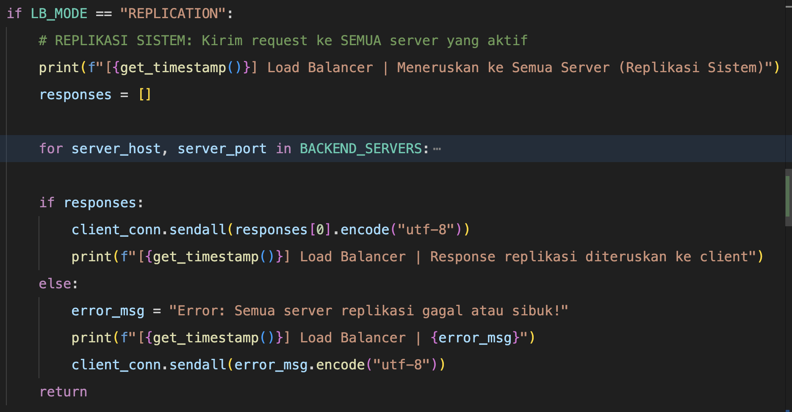
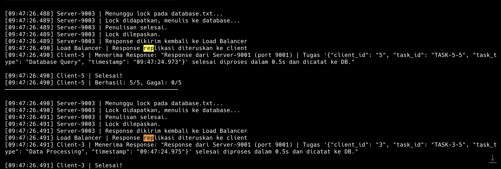

# Nama: M. Hamdani Ilham Latjoro
# NIM: D082252019
# Sistem Distribusi dengan Replikasi

# Mekanisme Replikasi pada Simulasi Sistem Terdistribusi

Dalam sistem terdistribusi, **Replikasi** merujuk pada proses menduplikasi data atau tugas ke beberapa server sekaligus agar sistem memiliki ketersediaan yang tinggi (High Availability) dan ketahanan terhadap kegagalan (Fault Tolerance). Pada simulasi ini, mekanisme Replikasi diimplementasikan pada **Load Balancer**.

Berikut adalah penjelasan lengkap mengenai mekanisme replikasi yang diterapkan:

---

## 1. Mekanisme Replikasi di Load Balancer (`load_balancer.py`)

Sebelumnya, Load Balancer membagi beban kerja secara _Round-Robin_ (satu request dilempar ke satu server secara bergantian). Setelah Replikasi diaktifkan, setiap 1 _request_ yang datang dari klien akan langsung disalin dan didistribusikan ke **seluruh backend server** yang aktif.

### A. Pengaktifan Mode Replikasi
*   **Konfigurasi**: Disetel menggunakan variabel `LB_MODE = "REPLICATION"` di dalam file pengaturan Load Balancer.
*   **Mekanisme Kerja**:
    1. Klien mengirim *task payload* ke Load Balancer.
    2. Load Balancer menerima pesan tersebut dan mengunci daftar server aktif.
    3. Load Balancer me-*looping* iterasi ke seluruh tabel server (`BACKEND_SERVERS`).
    4. Untuk masing-masing server, jika server tidak "sibuk" (dicek dari _semaphore/resource limit_) dan server dikonfirmasi "hidup" (_health check_), Load Balancer mengirimkan *task payload* tersebut.
    5. Setiap data yang terkirim bersifat menduplikasi beban dari satu client menjadi _multi-workload_ ke tiga server sekaligus (Server 9001, 9002, 9003).

### B. Fallback dan Penanganan Respons
*   Setelah Replikasi dilempar ke seluruh server yang menyala, Load Balancer menampung semua balasan (_responses_).
*   Balasan yang sukses (_success result_) dari server tercepat yang pertama kali selesai merespons akan diteruskan (dikembalikan) kepada klien, sehingga klien mendapatkan hasil layaknya berkomunikasi dengan single-server. Load Balancer secara transparan menyembunyikan arsitektur multi-node dari pandangan klien.

---

## 2. Cara Menjalankan Simulasi Replikasi

Untuk melihat mekanisme replikasi ini beraksi secara *real-time*, eksekusi *script launcher* bernama `run_simulation.py`.

**Langkah Eksekusi:**
1. Pastikan Anda berada dalam direktori proyek.
2. Eksekusi program simulasi utama:
```bash
python3 run_simulation.py
```

Pada log terminal, setiap _request_ dari satu Klien (misalnya Client-1) akan tertulis dibagikan/diteruskan ke semua server.

---

## 3. Analisis Log Hasil Eksekusi Replikasi

Ketika mode `REPLICATION` dinyalakan, proses rekam jejak pada sistem akan membuktikan bahwa duplikasi berhasil dilakukan.

### Bukti Replikasi Bekerja (Terminal Output Load Balancer)
```
[10:15:30.112] Load Balancer | Request diterima dari ('127.0.0.1', 54321)
[10:15:30.112] Load Balancer | Data: "{"client_id": "1", "task_id": "TASK-1-1"..."}"
[10:15:30.112] Load Balancer | Meneruskan ke Semua Server (Replikasi Sistem)
[10:15:30.615] Load Balancer | Response replikasi diteruskan ke client
```

### Bukti Tersimpan di Seluruh Node Database (`database.txt`)
Karena ada 3 server replika, tugas yang sama ("TASK-1-1") akan dikerjakan tiga kali dan dicatat tiga kali pada shared database oleh node server yang berbeda secara bersamaan:
```text
[10:15:30.612] Server-9002 memproses '{"client_id": "1", "task_id": "TASK-1-1"...}' dari 127.0.0.1
[10:15:30.613] Server-9003 memproses '{"client_id": "1", "task_id": "TASK-1-1"...}' dari 127.0.0.1
[10:15:30.614] Server-9001 memproses '{"client_id": "1", "task_id": "TASK-1-1"...}' dari 127.0.0.1
```
Terlihat jelas satu buah request `TASK-1-1` benar-benar dikerjakan oleh Server-9001, Server-9002, dan Server-9003. Ini membuktikan bahwa sistem distribusi telah berhasil mengaplikasikan algoritma replikasi.

## Lampiran: Screenshot

### Kode Program Replikasi


### Log Output Replikasi

